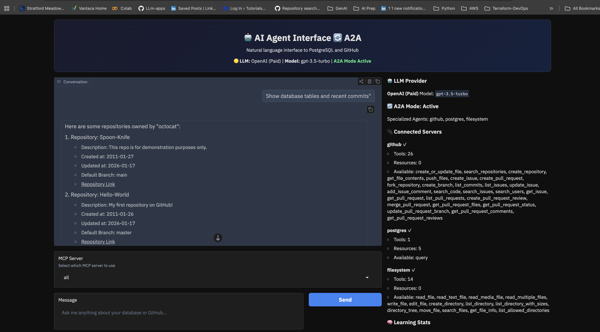

# Testing Guide for MCP Toolkit



This guide helps you verify that all MCP Toolkit features are working correctly.

## Quick Health Check

Run this command to verify basic setup:

```bash
# Check Python version (must be 3.11+)
python3.11 --version

# Check if app is running
curl -s http://localhost:7860 > /dev/null && echo "✓ App is running" || echo "✗ App not running"

# Check logs for initialization
tail -20 /tmp/mcp_app.log | grep -E "ready|initialized|Error"
```

## 1. Testing Standard Mode

### What to Test
Basic single-agent queries without orchestration.

### Test Steps

1. **Start the app**
   ```bash
   ./start.sh
   ```

2. **Open browser** at http://localhost:7860

3. **Select a single server** (e.g., "github" or "postgres") from the dropdown

4. **Uncheck** the "🧠 Agentic Mode" checkbox

5. **Try these queries:**

   | Query | Expected Result |
   |-------|-----------------|
   | "List my GitHub repositories" | Shows repo list |
   | "Show database tables" | Shows table names |
   | "What files are in the current directory?" | Shows file list |

### Expected Behavior
- Response appears in 2-5 seconds
- Single tool call per query
- No planning steps shown

---

## 2. Testing A2A Mode (Multi-Agent)

### What to Test
Multiple specialized agents working together.

### Prerequisites
```bash
# Ensure A2A is enabled in .env
grep "A2A_ENABLED" .env
# Should show: A2A_ENABLED=true
```

### Test Steps

1. **Select "all"** from the MCP Server dropdown

2. **Try these multi-domain queries:**

   | Query | Expected Agents |
   |-------|-----------------|
   | "Show my repos and database tables" | GitHub + Database |
   | "List files and GitHub issues" | Filesystem + GitHub |
   | "Compare database schema with repo structure" | Database + GitHub + Filesystem |

### Expected Behavior
- Header shows "A2A Mode Active"
- Server status shows "Specialized Agents: github, postgres, filesystem"
- Response combines results from multiple agents

### Verify in Logs
```bash
tail -50 /tmp/mcp_app.log | grep -E "A2A|orchestrat|agent"
```

Should show:
```
Mode: A2A Orchestration
Routing to agents: github, postgres
```

---

## 3. Testing Agentic Loop (Plan-Act-Observe-Reflect)

### What to Test
Multi-step reasoning with planning and self-correction.

### Prerequisites
```bash
# Ensure Agentic Mode is enabled in .env
grep "AGENTIC_MODE" .env
# Should show: AGENTIC_MODE=true

# Restart app after changing .env
./stop.sh && ./start.sh
```

### Test Steps

1. **Check the "🧠 Agentic Mode" checkbox** in the UI

2. **Try these complex queries:**

   | Query | Expected Steps |
   |-------|----------------|
   | "Find all repos with open issues, then count them" | 2-3 steps |
   | "List tables, then show the schema of the largest one" | 2-3 steps |
   | "Search for Python files and summarize their purpose" | 2-4 steps |

### Expected Behavior
Response should show planning structure:
```
🎯 Planning: Analyzing task...
📋 Plan created (3 steps):
   1. Search repositories for the user
   2. List open issues for each repository
   3. Summarize findings

⚡ Step 1/3: Search repositories for the user
✅ Completed: Found 5 repositories

⚡ Step 2/3: List open issues for each repository
✅ Completed: Found 12 open issues

⚡ Step 3/3: Summarize findings
✅ Completed: Summary generated

📊 Summary (Progress: 3/3):
[Final combined results...]
```

### Verify in Logs
```bash
tail -100 /tmp/mcp_app.log | grep -E "Agentic|Plan|Step|Reflect"
```

Should show:
```
Mode: Agentic Loop (Plan-Act-Observe-Reflect)
```

---

## 4. Testing Evaluation Framework

### What to Test
Automated testing of agent performance.

### Run Quick Evaluation

```bash
# Run easy tests only (fastest)
python3.11 run_eval.py --quick
```

### Run Full Evaluation

```bash
# Run all tests
python3.11 run_eval.py

# Run GitHub tests only
python3.11 run_eval.py --category github

# Run database tests only
python3.11 run_eval.py --category database

# Run by difficulty
python3.11 run_eval.py --difficulty easy
python3.11 run_eval.py --difficulty medium
```

### Expected Output

```
============================================================
               AGENT EVALUATION REPORT
============================================================
Timestamp: 2026-01-27T00:15:30

📊 Overall Results:
   Total Cases: 7
   Passed: 6 (85.7%)
   Failed: 1

⏱️  Performance:
   Avg Latency: 2340ms
   Avg Efficiency: 78.5%

🎯 Accuracy:
   Tool Accuracy: 82.3%
   Result Accuracy: 88.1%

📁 By Category:
   github: 2/2 (100%)
   database: 3/3 (100%)
   multi-domain: 1/2 (50%)

📈 By Difficulty:
   easy: 4/4 (100%)
   medium: 2/2 (100%)
   hard: 0/1 (0%)
============================================================

📄 Results saved to eval_results.json
```

### Check Results File

```bash
# View saved results
cat eval_results.json | python -m json.tool | head -50
```

### Success Criteria

| Metric | Minimum | Good | Excellent |
|--------|---------|------|-----------|
| Pass Rate | 60% | 80% | 95% |
| Tool Accuracy | 50% | 70% | 90% |
| Result Accuracy | 50% | 70% | 90% |
| Avg Latency | < 15s | < 10s | < 5s |

---

## 5. Testing Self-Learning (Cache)

### What to Test
Query caching and learning from feedback.

### Test Steps

1. **First query** (fresh):
   ```
   "List all tables in the database"
   ```
   - Note: Response takes 2-5 seconds

2. **Click 👍** on the response

3. **Ask similar query**:
   ```
   "show me all database tables"
   ```
   - Note: Response should be nearly instant (< 0.5s)

4. **Check stats** in the right panel under "Learning Stats"

### Expected Behavior
- "Cached Queries" count increases
- "Cache Hit Rate" increases over time
- "Positive Feedback" count increases after 👍

### Verify in Logs
```bash
grep -E "cache|Cache|memory" /tmp/mcp_app.log | tail -10
```

---

## 6. Troubleshooting Tests

### Test: App Won't Start

```bash
# Check for port conflicts
lsof -i :7860

# Kill conflicting processes
./stop.sh

# Check Python version
python3.11 --version

# Check dependencies
pip list | grep -E "mcp-use|gradio|langchain"
```

### Test: GitHub Authentication

```bash
# Test GitHub token
source .env
curl -s -H "Authorization: token $GITHUB_TOKEN" https://api.github.com/user | head -5
```

Should show your GitHub username, not an error.

### Test: Database Connection

```bash
# Test database URL
source .env
psql "$DATABASE_URL" -c "SELECT 1"
```

Should return `1`.

### Test: LLM Provider

```bash
# Check which provider is configured
grep "LLM_PROVIDER" .env

# For GitHub Models, test the endpoint
curl -s -H "Authorization: Bearer $GITHUB_TOKEN" \
  https://models.inference.ai.azure.com/models | head -5
```

---

## 7. Performance Benchmarks

### Run Performance Test

```python
# Create a file: test_performance.py
import asyncio
import time
from agent_service import AgentService

async def benchmark():
    service = AgentService()
    await service.initialize()

    queries = [
        "List tables",
        "Show repos",
        "Count employees",
    ]

    for query in queries:
        start = time.time()
        async for chunk in service.stream(query):
            pass
        elapsed = time.time() - start
        print(f"{query}: {elapsed:.2f}s")

    await service.cleanup()

asyncio.run(benchmark())
```

### Expected Performance

| Query Type | Standard Mode | A2A Mode | Agentic Mode |
|------------|---------------|----------|--------------|
| Simple | 1-3s | 2-4s | 3-6s |
| Medium | 3-5s | 4-8s | 6-12s |
| Complex | 5-10s | 8-15s | 10-30s |

---

## 8. Feature Verification Checklist

Use this checklist to verify all features:

### Core Features
- [ ] App starts without errors (`./start.sh`)
- [ ] UI loads at http://localhost:7860
- [ ] Server status panel shows connected servers
- [ ] Chat input accepts queries
- [ ] Responses appear in chat

### A2A Mode
- [ ] A2A badge shows in header when enabled
- [ ] "all" server option works
- [ ] Multi-domain queries use multiple agents
- [ ] Results combine from multiple sources

### Agentic Loop
- [ ] "🧠 Agentic Mode" checkbox appears
- [ ] Checking it enables planning mode
- [ ] Responses show step-by-step execution
- [ ] Self-correction on failures (if any)

### Evaluation Framework
- [ ] `python3.11 run_eval.py --quick` runs without errors
- [ ] Report shows pass/fail statistics
- [ ] `eval_results.json` is created
- [ ] Results show metrics breakdown

### Self-Learning
- [ ] First query takes 2-5 seconds
- [ ] Similar query (after 👍) is faster
- [ ] Learning Stats update in UI
- [ ] Cache persists across sessions

---

## Quick Commands Reference

```bash
# Start app
./start.sh

# Stop app
./stop.sh

# View logs
tail -f /tmp/mcp_app.log

# Run evaluations
python3.11 run_eval.py --quick
python3.11 run_eval.py --category github

# Check configurations
cat .env | grep -E "LLM|A2A|AGENTIC"

# Test GitHub token
source .env && curl -H "Authorization: token $GITHUB_TOKEN" https://api.github.com/user
```

---

## Getting Help

If tests fail:

1. **Check logs**: `tail -100 /tmp/mcp_app.log`
2. **Verify .env**: All required variables set
3. **Restart clean**: `./stop.sh && ./start.sh`
4. **Check dependencies**: `pip install -r requirements.txt`

For more help, see:
- [Architecture Overview](ARCHITECTURE.md)
- [LLM Providers Guide](LLM_PROVIDERS.md)
- [Agentic Improvements](AGENTIC_IMPROVEMENTS.md)
